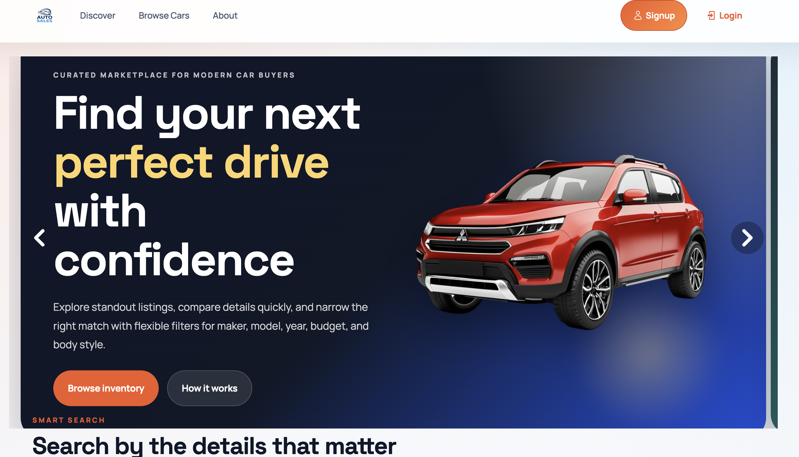

# Car E-commerce

A web application for an e-commerce car sales platform built with Laravel.


## Features

- Car listings with detailed information
- Car features and specifications
- Multiple car images support
- User management system
- City and state management
- Car makers and models
- Fuel types and car types
- Responsive design

## Tech Stack

- **Backend**: Laravel 12
- **Frontend**: Blade templates, Vite
- **Database**: SQLite (configurable)
- **PHP**: 8.2+

## Installation

1. **Clone the repository**

    ```bash
    git clone https://github.com/Lequanghy/CarECommerce
    ```

2. **Install PHP dependencies**

    ```bash
    composer install
    ```

3. **Install Node.js dependencies**

    ```bash
    npm install
    ```

4. **Environment setup**

    ```bash
    cp .env.example .env
    php artisan key:generate
    ```

5. **Database setup**

    ```bash
    php artisan migrate
    php artisan db:seed  # Optional: seed with sample data
    ```

6. **Build assets**

    ```bash
    npm run build
    # or for development
    npm run dev
    ```

7. **Start the development server**
    ```bash
    php artisan serve
    ```

## Usage

- Visit `http://localhost:8000` in your browser
- Register/Login to access the application
- Browse and manage car listings
- Add/edit car information, features, and images

## Database Models

- **User**: User accounts
- **Car**: Car listings
- **CarFeatures**: Car specifications
- **CarImage**: Car photos
- **CarType**: Vehicle types
- **FuelType**: Fuel options
- **Maker**: Car manufacturers
- **Model**: Car models
- **City**: Location cities
- **State**: Location states

## Development

- **Run tests**: `php artisan test`
- **Code style**: `composer run pint`
- **Clear cache**: `php artisan optimize:clear`

## License

MIT License
